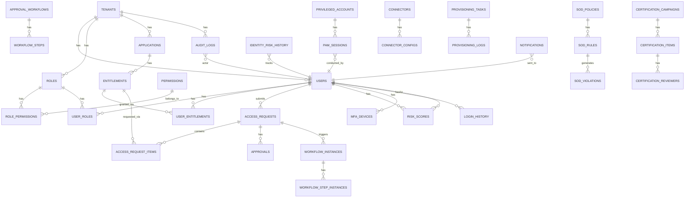

# Architecture Overview

## System Architecture

The IGA platform follows a microservice-ready, layered architecture deployed as containers.

```
┌──────────────────────────────────────────────────────────────────────┐
│                         Client Layer                                  │
│   Browser (React SPA) │ SCIM Clients │ REST API Clients │ GraphQL    │
└─────────────────┬──────────────────────────────────────────────────── ┘
                  │ HTTPS/TLS 1.3
┌─────────────────▼────────────────────────────────────────────────────┐
│                    NGINX (Reverse Proxy)                               │
│   SSL Termination │ Rate Limiting │ Static Files │ WebSocket Upgrade  │
└─────────────────┬────────────────────────────────────────────────────┘
                  │
┌─────────────────▼────────────────────────────────────────────────────┐
│                    FastAPI Application                                 │
│  ┌────────────┐ ┌──────────┐ ┌──────────┐ ┌─────────────────────┐   │
│  │ Middleware  │ │  Routes  │ │ Services │ │   Background Tasks  │   │
│  │ Auth       │ │ /api/v1/ │ │ Business │ │   Celery Workers    │   │
│  │ Tenant     │ │ /scim/v2/│ │  Logic   │ │   Beat Scheduler    │   │
│  │ Rate Limit │ │ /graphql │ │          │ │                     │   │
│  │ Security   │ │ /ws/     │ │          │ │                     │   │
│  └────────────┘ └──────────┘ └──────────┘ └─────────────────────┘   │
└──────┬───────────────────────────────────────────────────────────────┘
       │
┌──────▼───────────────────────────────────────────────────────────────┐
│                    Data & Message Layer                                │
│  PostgreSQL 16    │   Redis 7         │   RabbitMQ       │  MinIO    │
│  Primary Store    │   Cache/Sessions  │   Message Broker │  Storage  │
│  Audit Logs       │   Blacklist       │   Task Queues    │           │
└──────────────────────────────────────────────────────────────────────┘
```

## Database Schema (ER Diagram)



## Multi-Tenancy Design

All database tables include a `tenant_id` (UUID) foreign key. Data isolation is enforced at:

1. **Middleware level** — `TenantMiddleware` resolves and validates the tenant from JWT claims, HTTP headers, or subdomain
2. **Service level** — All database queries include `WHERE tenant_id = ?`
3. **Model level** — SQLAlchemy models have `tenant_id` as a required column

```python
# Every query automatically scoped to tenant
result = await db.execute(
    select(User).where(
        User.tenant_id == current_tenant_id,
        User.deleted_at.is_(None)
    )
)
```

## Authentication Flow

```
User → POST /auth/login
  → Password verification (Argon2id)
  → MFA challenge (if enabled)
  → Issue JWT access token (15min) + refresh token (7 days)
  → Store token JTI in Redis for blacklist checking

Subsequent requests:
  → Bearer token extraction
  → JWT signature verification
  → Redis blacklist check (JTI not revoked)
  → User load from Redis cache (5min TTL)
  → Tenant resolution
  → Rate limit check
  → Route handler
```

## Request Approval Workflow

```
Access Request Submitted
  ↓
SoD Pre-check (preventive control)
  ↓ [if no SoD violation]
Workflow Engine selects workflow template
  ↓
Step 1: Manager Approval (SLA: 48h)
  ↓ [if approved]
Step 2: App Owner Approval (if high-risk)
  ↓ [if approved]
Provisioning Task queued (Celery)
  ↓
Connector executes provisioning
  ↓
Audit log + WebSocket notification
```

## Risk Scoring Algorithm

```
CompositeRisk = (
    SoD_Score × 0.30 +
    Anomaly_Score × 0.20 +
    OverProvisioning_Score × 0.15 +
    CertFailure_Score × 0.20 +
    PeerDeviation_Score × 0.15
)

Risk Level:
  0-25:   Low
  25-50:  Medium
  50-75:  High
  75-100: Critical
```

## API Design Principles

- **REST**: Follows OpenAPI 3.0, versioned at `/api/v1/`
- **Response envelope**: `{ "success": bool, "data": T, "message": str }`
- **Pagination**: Cursor-based for large datasets
- **SCIM 2.0**: RFC 7644 compliant for enterprise identity provisioning
- **GraphQL**: Strawberry schema at `/graphql` for flexible queries
- **WebSocket**: Real-time notifications at `/ws/{tenant_id}/{user_id}`

## Security Architecture

### Encryption
- **At rest**: AES-256-GCM for sensitive connector configs and credentials
- **In transit**: TLS 1.3 (NGINX terminates, internal HTTP)
- **Passwords**: Argon2id with per-user salt

### Key Management
- Secrets loaded from environment variables or HashiCorp Vault
- Key rotation supported without service restart
- JWT signing keys rotatable with grace period

### Zero Trust
- No implicit trust; all requests re-authenticated
- Short-lived access tokens (15 min)
- Device fingerprinting for anomaly detection
- OPA evaluates context-aware policy at request time

## Observability

| Component | Purpose |
|-----------|---------|
| Prometheus | Metrics scraping (HTTP request rates, latency, error rates) |
| Grafana | Dashboards for operational visibility |
| Elasticsearch | Log storage and full-text search |
| Logstash | Log processing pipeline |
| Kibana | Log visualization and investigation |
| OpenTelemetry | Distributed tracing (spans across services) |
